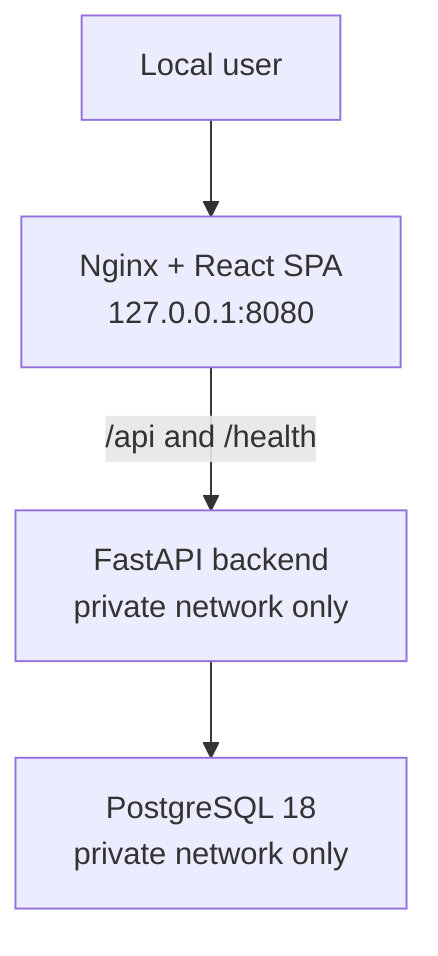

# Workboard Platform Lab

A secure Platform Engineering lab built around a task-management application.

The project starts with a single-node architecture and evolves through reproducible delivery, infrastructure automation, observability, cloud migration, and reliability practices. It is designed as a hands-on DevOps / Platform Engineering portfolio project.

> Current status: local Docker Compose environment validated. CI/CD and IaaS deployment are the next milestones.

## Current stack

- Frontend: React + Vite single-page application (SPA)
- Edge: Nginx Open Source
- Backend: FastAPI + synchronous SQLAlchemy + psycopg
- Database: PostgreSQL 18
- Database migrations: Alembic
- Local runtime: Docker Compose
- Development environment: macOS ARM64 with Colima

## Architecture



The local environment uses three Docker networks:

| Network | Connected services | Purpose |
|---|---|---|
| `edge` | `web` | Entry network for the web container. |
| `app_private` | `web`, `backend` | Private Nginx-to-FastAPI communication. |
| `data_private` | `backend`, `migrate`, `db` | Private application-to-database communication. |

`data_private` is internal in the base Compose definition. The local override temporarily makes it non-internal only to allow PostgreSQL access through `127.0.0.1:5432` from DBeaver. This exception is not part of the production design.

## Security decisions implemented

- The backend has no published host port.
- Nginx is the only HTTP entry point in the local stack.
- Backend and Nginx containers run as non-root users.
- Containers use read-only filesystems where applicable, writable `tmpfs` paths, dropped Linux capabilities, and `no-new-privileges`.
- Frontend static assets are served as read-only files.
- PostgreSQL uses SCRAM-SHA-256 authentication and data checksums.
- Database access follows least privilege:

  | Role | Responsibility |
  |---|---|
  | `postgres` | Bootstrap and database administration only |
  | `workboard_migrator` | Alembic schema migrations |
  | `workboard_app` | Runtime application queries |

- Passwords, JWT secrets, and local environment files are excluded from Git.
- Nginx returns security headers and proxies `/api` and `/health` internally.

## Application security behavior

- Unauthenticated requests return `401`.
- Resources outside a user's workspace return a generic `404`.
- A workspace viewer attempting a write operation receives `403`.
- Task updates use optimistic concurrency control. Stale versions return `409 task_version_conflict`.
- Passwords are hashed with Argon2.
- Authentication uses JSON Web Tokens (JWT).

## Run locally

### Prerequisites

- Docker Engine with Docker Compose V2
- A local `.env.local` file created from `.env.local.example`

```bash
cp .env.local.example .env.local
```

Set unique local-only values for the PostgreSQL roles and JWT secret. Never commit `.env.local`.

Start the stack:

```bash
docker compose --env-file .env.local \
  -f compose.yaml \
  -f compose.local.yaml \
  up --build
```

Validate the application entry point:

```bash
curl -i http://127.0.0.1:8080/health
```

Expected response:

```json
{"status":"ok"}
```

The backend must not be reachable directly from the host:

```bash
curl -i --connect-timeout 2 http://127.0.0.1:8000/health
```

This command should fail because the backend port is intentionally unpublished.

## Local database access

PostgreSQL is exposed only to the local loopback interface for development tooling:

```text
Host: 127.0.0.1
Port: 5432
Database: workboard
User: workboard_app
```

Use the password defined by `WORKBOARD_APP_DB_PASSWORD` in `.env.local`.

`workboard_migrator` is reserved for Alembic migrations and must not be used by the running backend.

## Validated locally

- Backend and frontend tests pass.
- Docker images build successfully on ARM64.
- Nginx serves the SPA and returns `200` through `/health`.
- FastAPI is inaccessible from the host on port `8000`.
- PostgreSQL roles and least-privilege permissions were verified.
- Database and web ports bind only to `127.0.0.1`.
